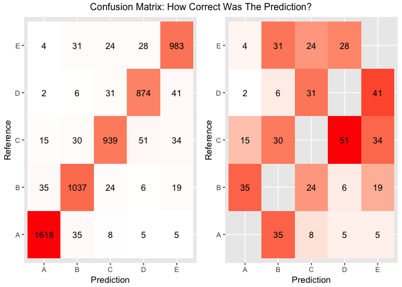

# Machine Learning Project: Using Sensor Data to Predict Body Position

## Getting and Cleaning the Data
The goal of this project is to predict what particular bicep curl a person is making based on sensor data. The data can be found __[here](http://groupware.les.inf.puc-rio.br/har)__

First, get the data. This does not be run everytime, so "eval" is set to FALSE until it is needed to run again


```r
url_training<-"https://d396qusza40orc.cloudfront.net/predmachlearn/pml-training.csv"
url_testing<-"https://d396qusza40orc.cloudfront.net/predmachlearn/pml-testing.csv"

download.file(url_training,destfile="Training.csv")
download.file(url_testing,destfile="Testing.csv")
```

Next, get the data into R and begin to explore the data. 


```r
#Load library
suppressPackageStartupMessages(library(data.table))
suppressPackageStartupMessages(library(ggplot2))
suppressPackageStartupMessages(library(gridExtra))
suppressPackageStartupMessages(library(randomForest))
suppressPackageStartupMessages(library(parallel))
suppressPackageStartupMessages(library(doParallel))
suppressPackageStartupMessages(library(caret))

training_raw<-read.csv("Training.csv",na.strings=c("NA","#DIV/0!",""))
testing_raw<-read.csv("Testing.csv",na.strings=c("NA","#DIV/0!",""))
```

The dimensions of the training data are 19622 rows by 160 columns. We are interested in predicting which activity or "classe" was performed by the user based on data collected by sensors. There are five classes (A,B,C,D,and E) based on performance of one set of 10 repetitions of the Unilateral Dumbbell Biceps Curl in five different fashions:

A) Exactly according to the specification
B) Throwing the elbows to the front
C) Lifting the dumbbell only halfway
D) Lowering the dumbbell only halfway
E) Throwing the hips to the front

Let's look at the data with NAs


```r
#Calculate How Many NAs there are in the training and testing sets. First 
#combine the two data frames (which requires eliminating the last column)
training_temporary<-training_raw[,1:159]
testing_temporary<-testing_raw[,1:159]
combineddf<-rbind(training_temporary,testing_temporary)
na_count_original<-sapply(combineddf, function (x) sum(is.na(x)))
na_count<-table(na_count_original)
na_count<-as.data.frame(na_count)
```

We also found that out of 160 columns, 
101 columns had NAs in them (with an average of 19271.02 NAs in each). There are two ways to deal with NAs: 1) subsitute a new value in place of the NA (a blank or an interpolation of the data) or 2) ignore the columns with NAs. Because there are so many NAs in these columns, it would simplify the model to simply exclude these columns from the creation of the algorithm. 


```r
#Turn NA counts into data frames
na_columns<-data.frame(na_count_original)
#Set row names as a column
na_columns<-setDT(na_columns, keep.rownames = TRUE)[]
#Eliminate non-zero rows
na_columns<-na_columns[na_columns$na_count_original==0,]
training<-training_raw[ , which(names(training_raw) %in% na_columns$rn)]
```

Let's explore the data a little more. First eliminate the variables with zero covariates (variables that have very little variability and won't be good predictors). Then find ten variables with the largest frequency ratios and use this information to decide which variables to put into the model.


```r
nsv <- nearZeroVar(training,saveMetrics=TRUE)
nsv_false<-nsv[nsv$zeroVar!=TRUE,]
nsv_false<-nsv[nsv_false$nzv!=TRUE,]
#Order the nsv_false data by frewRatio
nsv_topten<-nsv_false[order(nsv_false$freqRatio,decreasing=TRUE),]
#Grab the top ten
nsv_topten<-nsv_topten[1:10,]
#Make row names a column
nsv_topten<-setDT(nsv_topten, keep.rownames = TRUE)[]
nsv_topten
```

```
##                   rn freqRatio percentUnique zeroVar   nzv
##  1:        pitch_arm 87.256410     15.732341   FALSE FALSE
##  2:    pitch_forearm 65.983051     14.855774   FALSE FALSE
##  3:         roll_arm 52.338462     13.525634   FALSE FALSE
##  4:          yaw_arm 33.029126     14.657018   FALSE FALSE
##  5:      yaw_forearm 15.322835     10.146774   FALSE FALSE
##  6:     roll_forearm 11.589286     11.089593   FALSE FALSE
##  7:   pitch_dumbbell  2.277372     81.744980   FALSE FALSE
##  8:      gyros_arm_y  1.454369      1.916216   FALSE FALSE
##  9: gyros_dumbbell_y  1.264957      1.416777   FALSE FALSE
## 10: magnet_forearm_y  1.246914      9.540312   FALSE FALSE
```

There were 58 variables that do not have zero covariates. The list above shows the variables with the most variation and which will be the easiest to fit a model to. The last three in the list have very small "freqRatios" and "percentUniques", so let's use only the first seven in the list for building the model (Note: with fewer variables the calculations performed will be fewer, making the algorithm quicker at future predictions).

##Building the Model
Before building the model, the data will be separated into training and testing data sets. The new "training" set will be used to create the machine learning model while the new "testing" set will be used to confirm if the model is accurate enough. 


```r
#Note: we are using the original training data and not the training data with nas removed
set.seed(315)
#First, create a training and testing data sets from the original training set
inTrain <- createDataPartition(y=training_raw$classe,p=0.7, list=FALSE)
training_data <- training_raw[inTrain,]
testing_data <- training_raw[-inTrain,]
```

Now the model can be built using a Random Forest method and the clustering method outlined __[here](https://github.com/lgreski/datasciencectacontent/blob/master/markdown/pml-randomForestPerformance.md)__


```r
#Create partitions for cross validation
set.seed(315)
cluster <- makeCluster(detectCores() - 1) # convention to leave 1 core for OS
registerDoParallel(cluster)
fitControl <- trainControl(method = "cv",number = 10,allowParallel = TRUE)
set.seed(315)
#Now create the model from the training_data set
modelFit<-train(classe~pitch_arm+pitch_forearm+roll_arm+yaw_arm+yaw_forearm+
                    roll_forearm+pitch_dumbbell,data=training_data,method="rf",
            trControl = fitControl)
```

##Evaluating the Effectiveness
With the model built, let's look at its effectiveness. The model below provides a summary of the model. To cross-validate the data, the data was split into 10 partitions, or folds. Note: this was created in the previous code block with the "fitControl" step


```r
modelFit
```

```
## Random Forest 
## 
## 13737 samples
##     7 predictor
##     5 classes: 'A', 'B', 'C', 'D', 'E' 
## 
## No pre-processing
## Resampling: Cross-Validated (10 fold) 
## Summary of sample sizes: 12364, 12365, 12363, 12361, 12363, 12363, ... 
## Resampling results across tuning parameters:
## 
##   mtry  Accuracy   Kappa    
##   2     0.9181028  0.8964509
##   4     0.9215989  0.9008513
##   7     0.9151917  0.8927632
## 
## Accuracy was used to select the optimal model using  the largest value.
## The final value used for the model was mtry = 4.
```


Next let's look at the accuracy of the model and how important the variables were. 


```r
varImp(modelFit)
```

```
## rf variable importance
## 
##                Overall
## pitch_forearm   100.00
## roll_forearm     71.77
## roll_arm         56.73
## pitch_dumbbell   47.82
## yaw_arm          31.45
## yaw_forearm      18.69
## pitch_arm         0.00
```

```r
pred<-predict(modelFit,testing_data)
confusionMatrix(testing_data$classe,pred)$overall['Accuracy']
```

```
##  Accuracy 
## 0.9262532
```

The accuracy of the model on the test data set is 
0.926. This makes the out-of-sample error 0.074. This is acceptable enough, though the model accuracy could likely be improved by including every variable avaiable, but this would severely slow things down. 

The varImp function shows that only the "pitch_arm" variable is not important to the model fit, and could be taken out to reduce computations.

The graphs below show the confusion matrix in two ways (a confusion matrix highlights what the model correctly & incorrectly predicted in graphical form): the left one is the full confusion matrix and the right one is the same matrix but without the correct guesses shown (to highlight what was incorrect). This shows that there were very few wrong guesses made.


```r
confusionDF<-as.table(confusionMatrix(testing_data$classe,pred))
confusionDF<-data.frame(confusionDF)
## plot data
p1<-ggplot(confusionDF,aes(Prediction, Reference))+
        geom_tile(aes(fill=Freq))+
        geom_text(aes(label=Freq))+
        scale_fill_gradient(low="white",high = "red")+
        theme(legend.position="none")
#Create a data frame without the main diagnol of the confusion matrix to give a better glimpse at the errors
confusionDF2<-confusionDF[confusionDF$Prediction!=confusionDF$Reference,]
p2<-ggplot(confusionDF2,aes(Prediction, Reference))+
        geom_tile(aes(fill=Freq))+
        geom_text(aes(label=Freq))+
        scale_fill_gradient(low="white",high = "red")+
        theme(legend.position="none")
grid.arrange(p1,p2,ncol=2, top="Confusion Matrix: How Correct Was The Prediction?")        
```

<!-- -->

##Predictions
The model can now be used to predict what position twenty users' arms moved to make their bicep curls. 

Based on the model accuracy, I would expect that about 18.5 out of 20 of the predictions to be accurate.

The table below takes in the dataset given for the testing scenario and predicts which of the five classes of bicep curl the user was using. 


```r
predictions<-predict(modelFit,testing_raw)
data.frame(testing_raw$user_name,testing_raw$problem_id,predictions)
```

```
##    testing_raw.user_name testing_raw.problem_id predictions
## 1                  pedro                      1           B
## 2                 jeremy                      2           A
## 3                 jeremy                      3           B
## 4                 adelmo                      4           A
## 5                 eurico                      5           A
## 6                 jeremy                      6           E
## 7                 jeremy                      7           C
## 8                 jeremy                      8           B
## 9               carlitos                      9           A
## 10               charles                     10           A
## 11              carlitos                     11           B
## 12                jeremy                     12           C
## 13                eurico                     13           B
## 14                jeremy                     14           A
## 15                jeremy                     15           E
## 16                eurico                     16           E
## 17                 pedro                     17           A
## 18              carlitos                     18           B
## 19                 pedro                     19           B
## 20                eurico                     20           B
```


                
                
